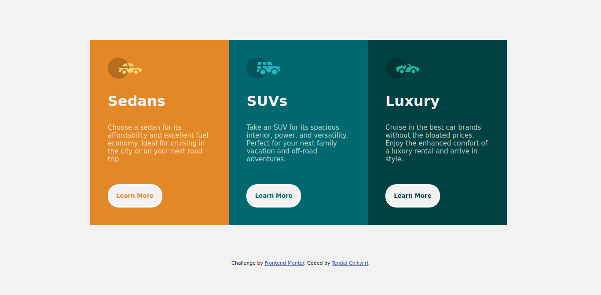

# Frontend Mentor - 3-column preview card component solution

This is a solution to the [3-column preview card component challenge on Frontend Mentor](https://www.frontendmentor.io/challenges/3column-preview-card-component-pH92eAR2-). Frontend Mentor challenges help you improve your coding skills by building realistic projects. 

## Table of contents

- [Overview](#overview)
  - [The challenge](#the-challenge)
  - [Screenshot](#screenshot)
  - [Links](#links)
- [My process](#my-process)
  - [Built with](#built-with)
  - [Useful resources](#useful-resources)
- [Author](#author)

## Overview

### The challenge

Users should be able to:

- View the optimal layout depending on their device's screen size
- See hover states for interactive elements

## Screenshot

### Desktop

### Mobile

### Links

- Solution URL: [Solution code](https://github.com/TendaiChikwiri/3-column-preview)
- Solution Live Preview: [Live Preview](https://tendaichikwiri.github.io/3-column-previeww)

### Built with

- HTML
- CSS 
- Flexbox
- CSS Grid

## Author

- Frontend Mentor - [@TendaiChikwiri](https://www.frontendmentor.io/profile/TendaiChikwiri)

